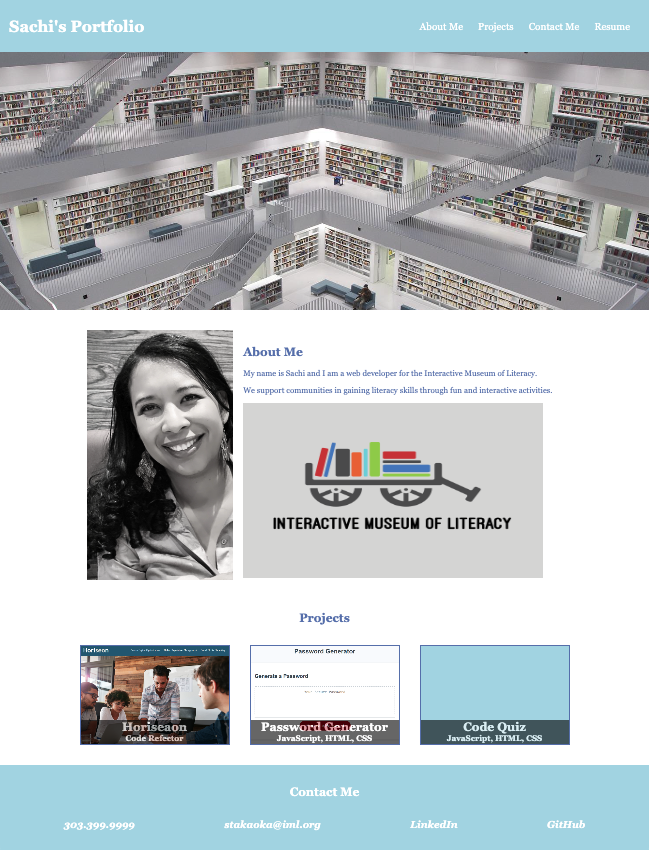

# Web-Profile

## Description

I created a profile that includes a short Bio of who I work for and my role in the organization.

At the top of the webpage you will find navigation links to direct you to my bio, contact information, and projects.

In the body of the webpage you will find a logo for the museum, my picture, my bio, link to my github pages, and contact information.

I added the hover selector in the CSS to change the color and size of the links to make the webpage more interactive.

The link for a phone number was added in place of an actual phone number for security and experimentation.

Thank you for checking it out!

## Table of Contents

- [Description](#Description)
- [Project URL](#Project-URL)
- [Deployment](#Deployment)
- [Demo/Screenshots](#Demo/Screenshots)
- [Technologies](#Technologies)
- [License](#License)
- [Resources](#Resources)
- [Contact](#Contact)
- [Author](#Author)

## Project URL

<https://github.com/kaleikautakaoka/Sachi-Portfolio>

## Delpoyment

- [https://kaleikautakaoka.github.io/Sachi-Portfolio](https://kaleikautakaoka.github.io/Sachi-Portfolio)

## Demo/Screenshots

  <table>
    <tr>
      <td>Portfolio Page Example</td>
    </tr>
    <tr>
      <td></td>
    </tr>
  </table>

## Technologies

```
HTML, CSS
```

## License

This project is [mit](https://choosealicense.com/licenses/mit/) licensed.

## Resources

- [pixabay](https://pixabay.com/)
- [w3schools](https://www.w3schools.com/)

## Contact

Email: stakaoka@iml.org

## Author

Author(s): Sachi Kaleikau-Takaoka
GitHub: <https://github.com/kaleikautakaoka>
